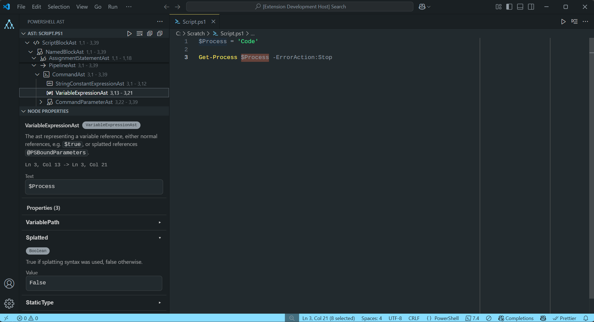

# PowerShell AST Inspector

Inspect and visualize the Abstract Syntax Tree (AST) of PowerShell scripts with
interactive tree view and detailed property examination.

## Features

- **🔍 Analyze PowerShell Scripts** - View the complete AST structure in an
  interactive tree view
- **📋 Inspect Node Properties** - See detailed properties and metadata for each
  AST node
- **🎯 Highlight Code** - Right-click any AST node to highlight the
  corresponding code in your editor
- **🕵️ Go to AST** - Right-click your code and reveal the corresponding AST node
  in the tree view

## Technical Details

The extension works by:

1. Reading PowerShell script content
2. Executing a PowerShell script that uses
   `System.Management.Automation.Language.Parser`
3. Converting the AST to JSON format
4. Displaying the structure in a VS Code tree view

The AST inspection provides information about:
- Node types (CommandAst, VariableExpressionAst, etc.)
- Source location (line and column numbers)
- Node relationships (parent-child hierarchy)
- Specific properties (command names, variable names, string values)
- Documentation for each node and property - straight from the PowerShell source
  code

## Development

This extension is open source and open to contributions. For development setup
and building instructions, see [CONTRIBUTING.md](CONTRIBUTING.md).

## License

MIT
